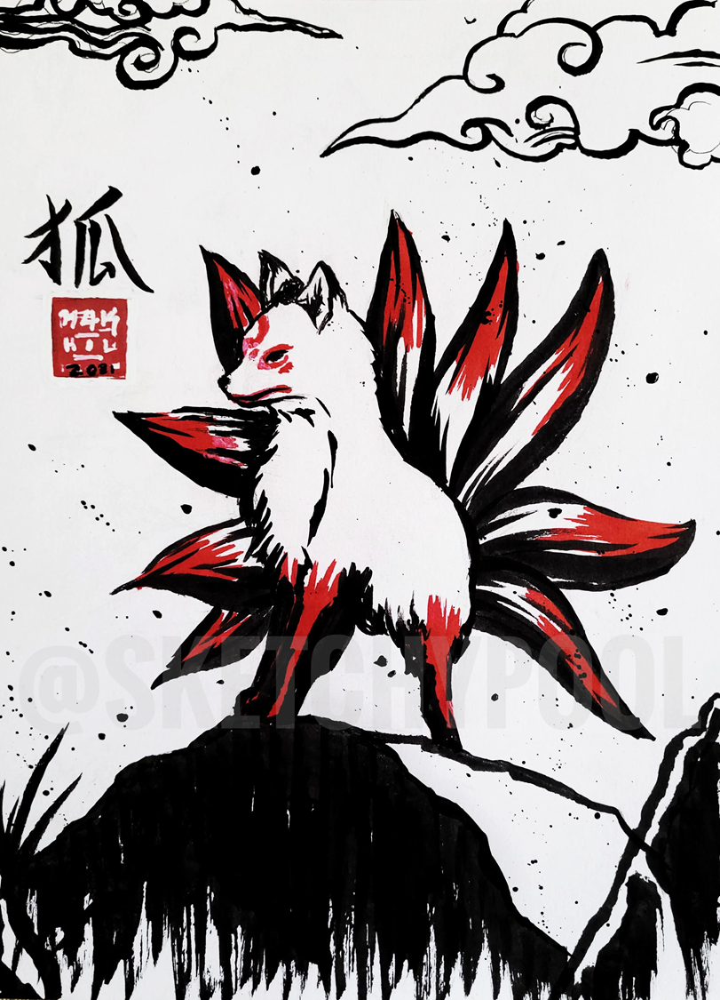
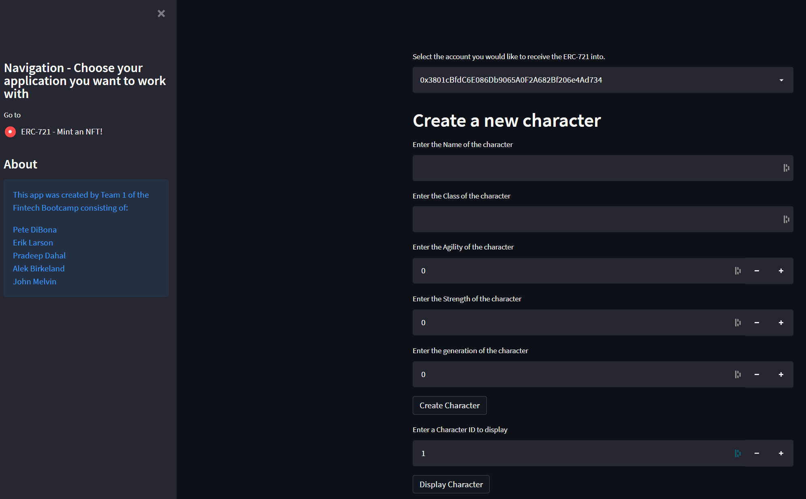

# Kitsune - A 'Game-Fi' dApp

## Goals:
* Create/Mint token (KitsuneCoin) and Kitsune Game items
* Create NFT DApp with a rewards based game component. 
* Allow users to generate NFTs 
* Users can go on “Quests” which bring in game rewards.

## Tools used:
* Remix
* Ganache
* Pycharm/Visual Studio Code
* Metamask
* Streamlit
* Awesome-streamlit

## Deployment
* Compile contracts using Remix.
* Deploy contracts for dApp (only erik_erc-721.sol is functional currently) using Remix
* Take deployed contract address and put into .env file.
* Use command line to CD into src/pages directory.
* run 'streamlit run Project_3_dApp' (broken one) and/or 'streamlit run erik_app.py' (working)

## Actions completed:
* Crowdsale contracts all completed, compiled and deployed into Ganache/Metamask using the Injected Web 3 method.
* ERC-1155 contract completed, compiled and deployed into Ganache/Metamask using the Injected Web 3 method.
* ERC-721 contract completed, compiled, deployed into Ganache/Metamask using the Injected Web 3 method.
* Awesome-streamlit upper level app Project_3_dApp completed, but it is buggy.
* ERC-721 dApp was completed and referenced in the upper level Project_3_dApp. Functional.

## Things we had issues with:
* Crowdsale did not work properly.
* Streamlit Main app (Project_3_dApp.py).
* Did not get around to Adding in the ERC-1155 functionality.
* Was not able to add in the questing funtionality.

# Screenshot of high level application which has the erik_app.py as the main window.

